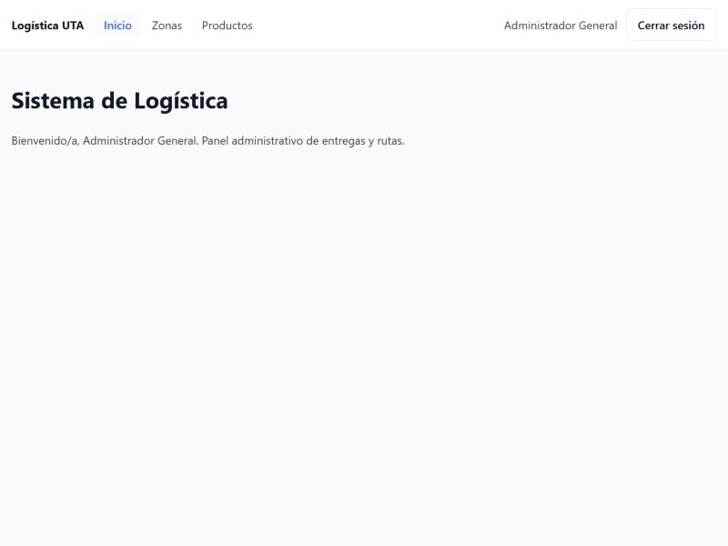
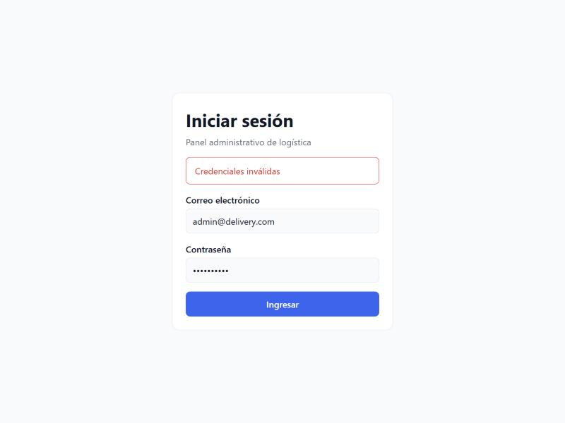
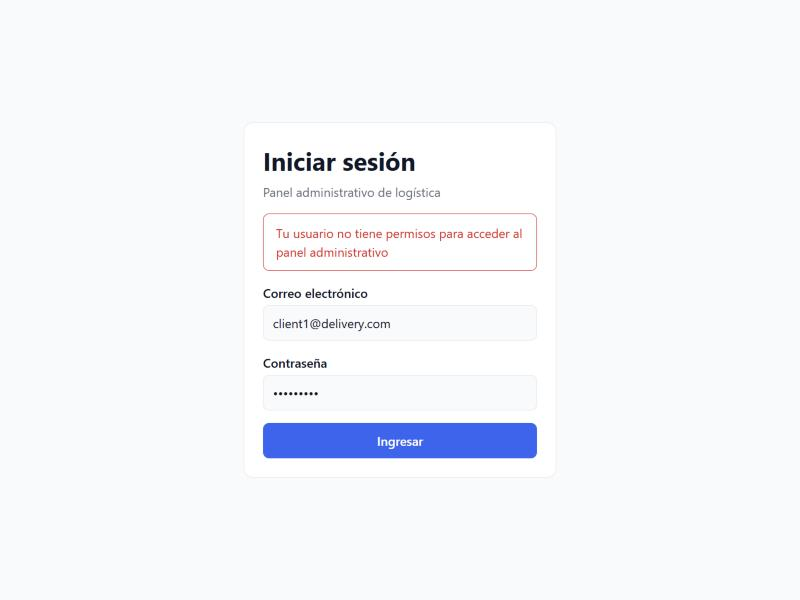
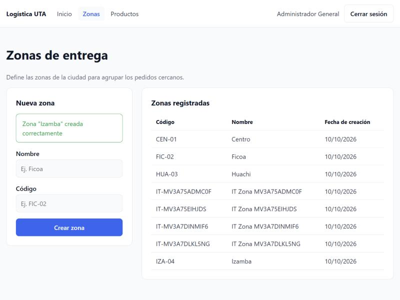
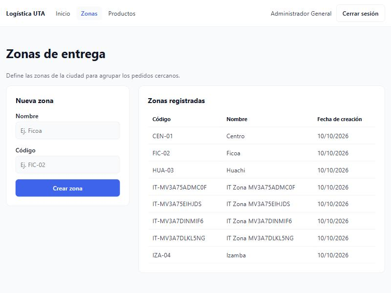
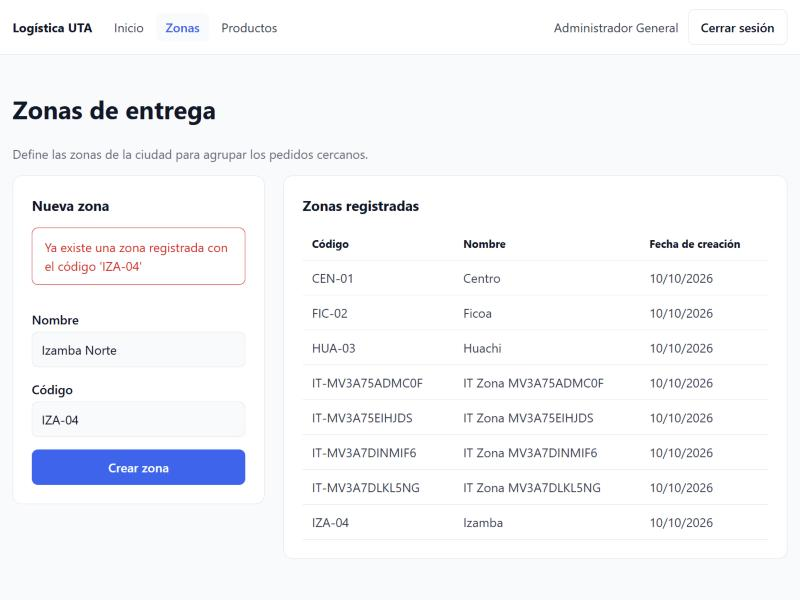
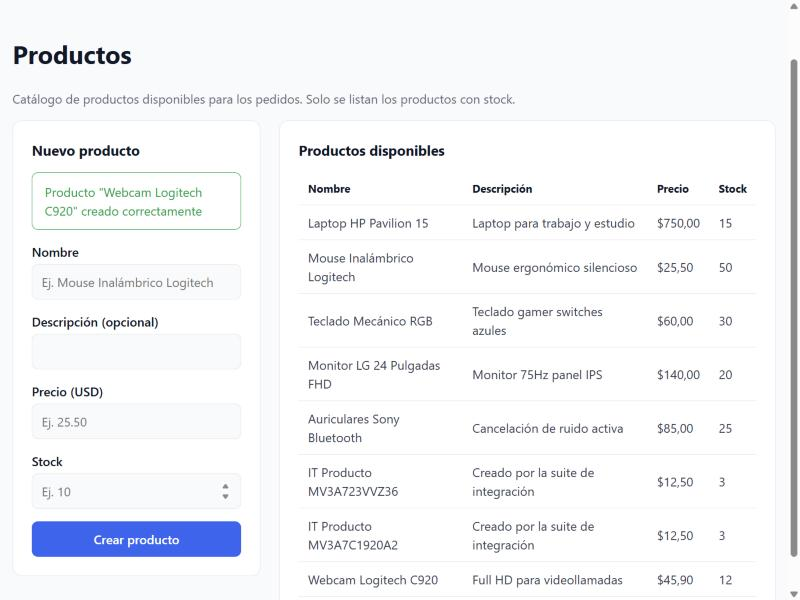
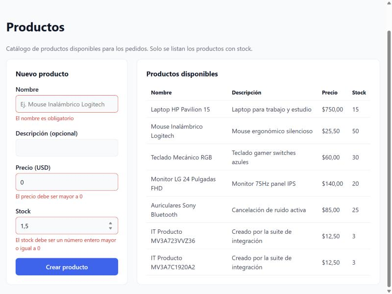
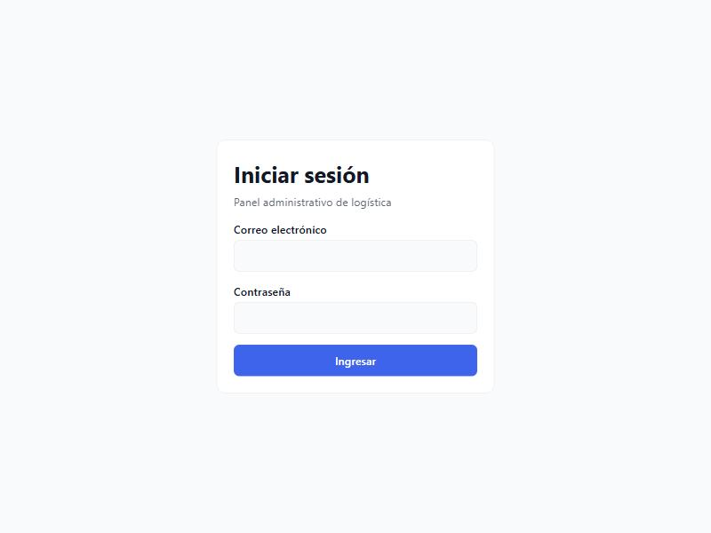

# Evidencia · Issue #4 — Integración real de login, zonas y productos

Verificación end-to-end del frontend web contra el backend real (NestJS + PostgreSQL), complementaria a las
pruebas de componentes con mocks.

- **Issue:** [#4](https://github.com/logistica-gc-uta/frontend-web-logistica/issues/4)
- **Fecha de ejecución:** 10/10/2026
- **Backend:** `logistica-gc-uta/backend` en `main` @ `a150123`
- **Frontend:** rama `test/4-integracion-real`

## 1. Preparación del entorno

### Backend (repositorio `backend`)

Base de datos recreada desde cero para incluir las migraciones de geolocalización y ciclo de vida de rutas:

```bash
docker compose down -v      # elimina el volumen local de PostgreSQL
docker compose up -d
pnpm install
pnpm prisma db init
pnpm run seed               # usuarios, zonas (con depósito) y productos de prueba
pnpm run start:dev          # http://localhost:3000/api/v1
```

### Frontend (este repositorio)

```bash
pnpm install
cp .env.integration.example .env.integration.local
# completar las contraseñas de los usuarios del seed (README del backend, "Credenciales por Defecto")
pnpm test:integration
```

`.env.integration.local` está ignorado por git: las credenciales no se suben al repositorio.

## 2. Pruebas de integración automatizadas

`pnpm test:integration` ejecuta `src/integration/**/*.int.test.ts` **sin mocks**: usa los mismos servicios del
frontend (`authService`, `zonesService`, `productsService`, `apiClient`) contra la API real. Cada ejecución
crea registros con un sufijo único (`IT Zona …`, `IT Producto …`), por lo que puede repetirse sin conflictos.

### Resultado

```
 ✓ auth.int.test.ts     > ADMIN inicia sesión y recibe un token JWT con su rol
 ✓ auth.int.test.ts     > rechaza una contraseña incorrecta con 401 y el mensaje del backend
 ✓ auth.int.test.ts     > el backend autentica a DRIVER, pero el panel web le niega el acceso
 ✓ auth.int.test.ts     > el backend autentica a CLIENT, pero el panel web le niega el acceso
 ✓ auth.int.test.ts     > un token inválido recibe 401 y dispara el cierre de sesión automático
 ✓ zones.int.test.ts    > lista las zonas persistidas en PostgreSQL
 ✓ zones.int.test.ts    > crea una zona y la nueva zona aparece al volver a consultar la API
 ✓ zones.int.test.ts    > rechaza un código duplicado con 409 y un mensaje claro
 ✓ zones.int.test.ts    > rechaza datos vacíos con 400 y los mensajes de validación del backend
 ✓ products.int.test.ts > lista solo productos con stock disponible
 ✓ products.int.test.ts > crea un producto desde los valores del formulario y aparece al volver a consultar la API
 ✓ products.int.test.ts > un producto creado con stock 0 se guarda pero no aparece en el listado
 ✓ products.int.test.ts > rechaza precio y stock inválidos con 400 y los mensajes de validación del backend

 Test Files  3 passed (3)
      Tests  13 passed (13)
```

## 3. Pruebas manuales en el navegador

Ejecutadas el 10/10/2026 con el backend levantado, `pnpm dev` y la app en `http://localhost:5173`
(navegador integrado, ventana de 1024×768). Las contraseñas se muestran ocultas por el campo y no aparecen tokens.

| #   | Caso                                                     | Resultado esperado                                                          | Resultado |
| --- | -------------------------------------------------------- | --------------------------------------------------------------------------- | --------- |
| M1  | Login ADMIN                                              | Ingresa al inicio y muestra el nombre del usuario en el encabezado          | ✅ Pasa   |
| M2  | Login con contraseña incorrecta                          | Mensaje "Credenciales inválidas"                                            | ✅ Pasa   |
| M3  | Login DRIVER (`driver1@delivery.com`)                    | Mensaje "Tu usuario no tiene permisos para acceder al panel administrativo" | ✅ Pasa   |
| M4  | Login CLIENT (`client1@delivery.com`)                    | Mismo mensaje de permisos que M3                                            | ✅ Pasa   |
| M5  | Crear zona `Izamba` / `IZA-04`                           | Mensaje de éxito y la zona aparece en la tabla                              | ✅ Pasa   |
| M6  | Recargar la página en **Zonas**                          | La sesión se mantiene y la zona creada sigue en la tabla                    | ✅ Pasa   |
| M7  | Crear `Izamba Norte` con el código `IZA-04`              | Mensaje "Ya existe una zona registrada con el código 'IZA-04'"              | ✅ Pasa   |
| M8  | Crear producto `Webcam Logitech C920` ($45,90, stock 12) | Mensaje de éxito y el producto aparece en la tabla                          | ✅ Pasa   |
| M9  | Enviar producto sin nombre, precio 0 y stock 1,5         | Mensajes de validación junto a cada campo, sin llamar al backend            | ✅ Pasa   |
| M10 | Cerrar sesión e ir a `/zonas`                            | Vuelve al login y `/zonas` redirige al login; sin token en `localStorage`   | ✅ Pasa   |

### Persistencia comprobada en la API

Tras M5 y M8 se consultó la API directamente (sin pasar por el frontend):

```
GET /api/v1/zones    → [('IZA-04', 'Izamba')]
GET /api/v1/products → [('Webcam Logitech C920', 45.9, 12)]
```

### Capturas

| M1 · Login ADMIN                   | M2 · Credenciales inválidas         |
| ---------------------------------- | ----------------------------------- |
|  |  |

| M3 · Rol DRIVER rechazado         | M4 · Rol CLIENT rechazado         |
| --------------------------------- | --------------------------------- |
|  |  |

| M5 · Zona creada                  | M6 · Tras recargar la página   |
| --------------------------------- | ------------------------------ |
|  |  |

| M7 · Zona duplicada (409)       | M8 · Producto creado                  |
| ------------------------------- | ------------------------------------- |
|  |  |

| M9 · Validaciones de producto       | M10 · Cierre de sesión y ruta protegida |
| ----------------------------------- | --------------------------------------- |
|  |          |

## 4. Hallazgos

| Hallazgo                                                                                                                                                                                                | Tipo                    | Acción                                                         |
| ------------------------------------------------------------------------------------------------------------------------------------------------------------------------------------------------------- | ----------------------- | -------------------------------------------------------------- |
| `GET /products` solo devuelve productos con `stock > 0`: un producto creado con stock 0 se guarda, pero no aparece en el listado.                                                                       | Comportamiento esperado | Documentado en la página de Productos y verificado en la suite |
| Las zonas ahora incluyen coordenadas de depósito (`depotLat`, `depotLng`, opcionales). El formulario web aún no las captura.                                                                            | Alcance futuro          | Se abordará con la planificación de rutas (#6 / #7)            |
| Al actualizar el backend, `migrations/app/refs/db.json` aparecía modificado solo por finales de línea (CRLF/LF) tras `prisma db init` en Windows, bloqueando `git pull`. Se resolvió con `git restore`. | Entorno local (Windows) | Sin cambios de código                                          |

No se encontraron defectos funcionales en el frontend ni en el backend para login, zonas y productos.

## 5. Verificaciones de calidad

| Comando                 | Resultado                     |
| ----------------------- | ----------------------------- |
| `pnpm lint`             | 0 errores                     |
| `pnpm typecheck`        | 0 errores                     |
| `pnpm test`             | 125/125 pruebas (25 archivos) |
| `pnpm test:integration` | 13/13 pruebas contra API real |
| `pnpm build`            | Correcto                      |
